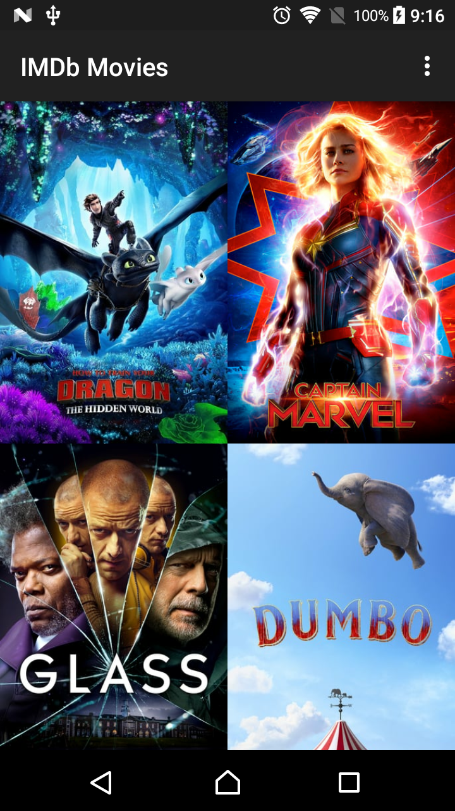
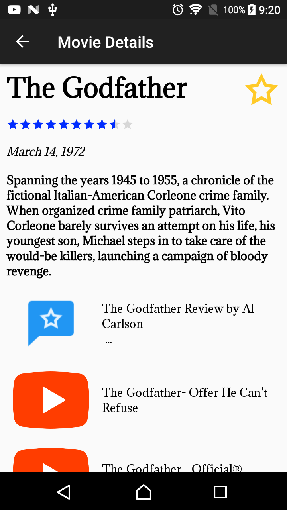
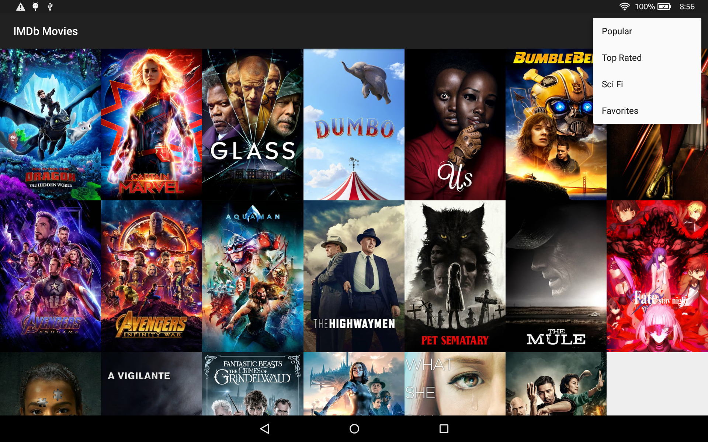
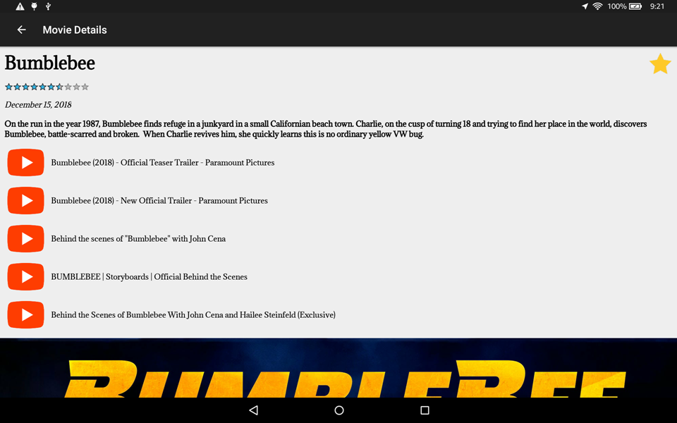

# Popular Movies

This is an Android application that discovers the most popular movies currently playing, created as part of the [Android Basics Nanodegree by Google](https://www.udacity.com/course/android-basics-nanodegree-by-google--nd803).

### Skills Demonstrated

Knowledge of how to bring mobile experiences to life is a critical skill for Android developers. Specifically, how to build clean and compelling user interfaces, fetch data from network services, and optimize the experience for various mobile devices. This app demonstrates an understanding of the foundational elements of programming for the Android platform. The app communicates with the internet and provides a responsive design by leveraging advanced framework classes.

- Fetch internet data using various API endpoints from [The Movie DB](https://www.themoviedb.org/).
- Custom adapters, viewholders, and layouts to populate a recycler grid.
- Third party libraries to simplify boilerplate code.

### API Key

This project requires an API key that has been removed in accordance with GitHub licensing requirements. Please visit [The Movie DB](https://www.themoviedb.org/account/signup) to obtain a free API key and add it to the utility class file.

#### Introduction grid on 720 x 1280p (API 25) in portrait orientation.

#### Item details on 720 x 1280p (API 25) in portrait orientation.

#### Introduction grid on 1920 x 1200p (API 22) in landscape orientation.

#### Item details on 1920 x 1200p (API 22) in landscape orientation.

